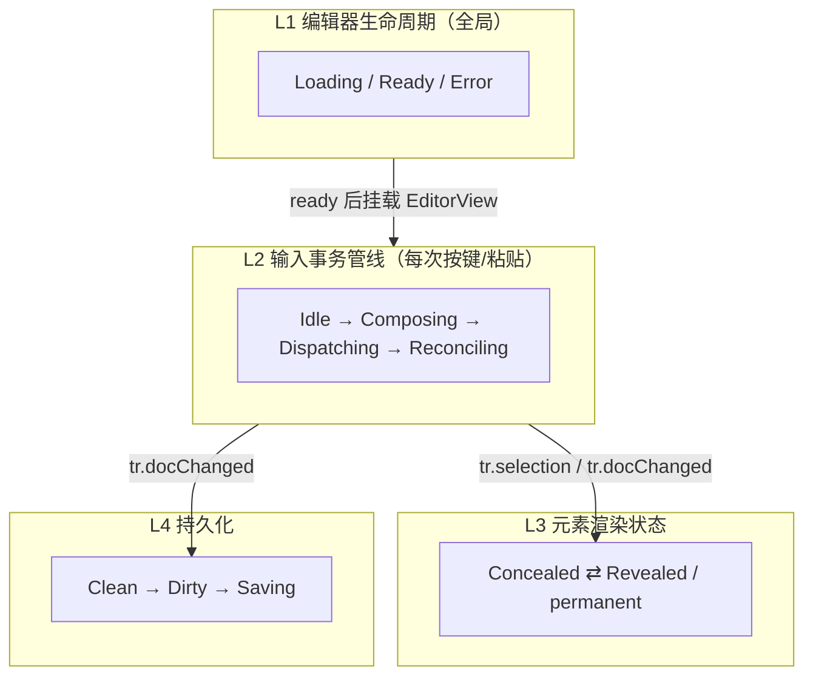
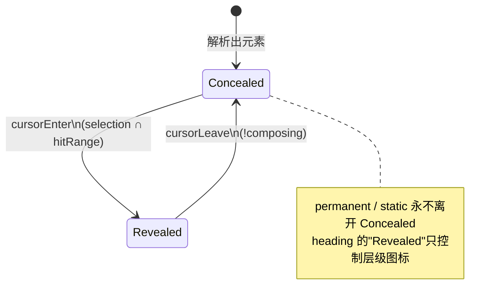
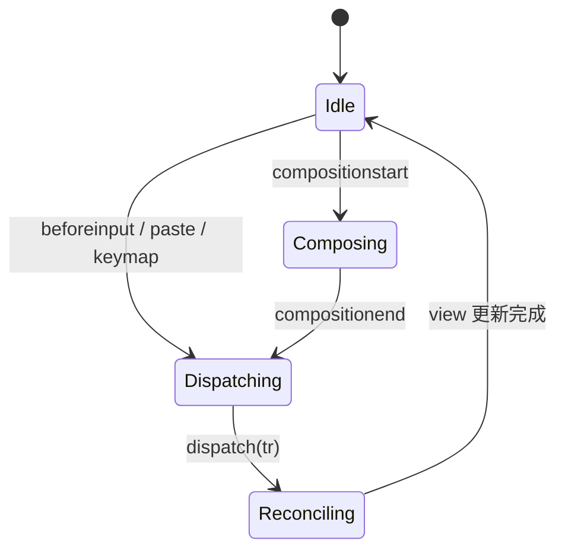
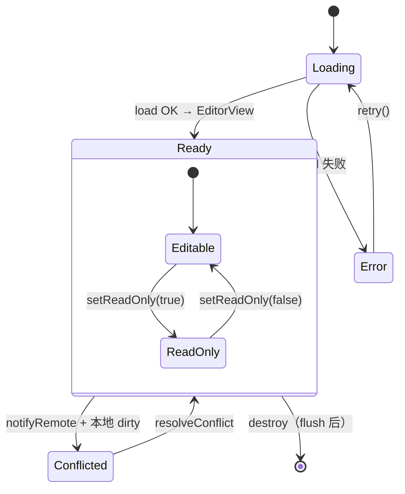
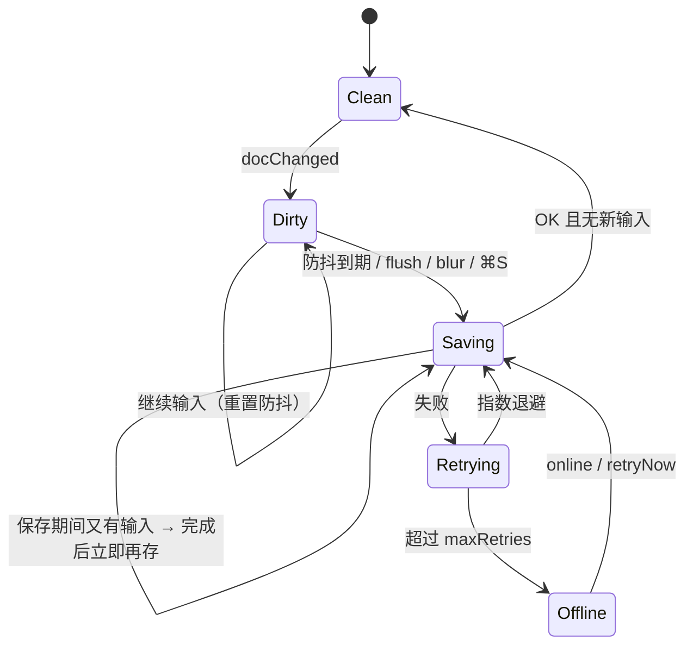

# 架构：四层状态机

`@21stware/handymd` 的核心不是富文本模型，而是：

> **文档即 Markdown 源码 + 按光标位置选择性隐藏标记符**

每个 Markdown 元素在 `Concealed`（渲染态）与 `Revealed`（源码态）之间切换，由 selection 驱动。实现上**不为每个元素建状态对象**——每次事务后由 `(doc, selection, composing, readOnly)` 四元组纯函数推导。



| 层 | 代码 |
|---|---|
| L1 | `src/editor.ts` — `HandyEditor` |
| L2 | `src/ime.ts` + `src/normalize.ts` + `src/caret.ts` + keymap + filterTransaction |
| L3 | `src/conceal/` — hitTest 纯函数 + 按块签名增量 decoration |
| L4 | `src/autosave.ts` |

---

## L3：Conceal / Reveal

### 两级语义

1. **行内元素**（`strong` / `em` / `code` / `strike` / `mark` / `link` / `image`）  
   - hit 区间 `[from-1, to+1]`（扩一格判定）  
   - selection 相交 → Revealed（标记可见、弱化色）  
   - 离开且非 composition → Concealed（`font-size:0` 隐藏标记，语义样式保留）

2. **块级 permanent**（`quote` / `bullet` / `todo` / `hr`）  
   - 一旦解析立即渲染，**永不**因光标进入回到源码  
   - 标记仍在源码中（序列化无损）

2.5 **diagram block**（```` ```mermaid ```` → `diagramOpen` / `diagramLine` / `diagramClose`）  
   - 结构化解析层就与 code block 分开；三种行共享整块区域作为 hit 区间  
   - Concealed（光标在区域外）→ 源码整块隐藏（开行折叠成 widget 宿主，体行/闭行零高），渲染图表 widget  
   - Revealed（光标进入区域 / 点击图表）→ 与普通代码块一致的围栏源码编辑态  
   - 渲染只发生在 Concealed 态，结果按 `(lang, code)` 缓存；readOnly 强制渲染态

3. **标题（特殊）**  
   - 源码 `#`/`##` 永远隐藏  
   - 聚焦时 gutter 展示层级图标（非源码）  
   - 因此**不**标 `permanent`，以便参与 reveal 判定驱动图标显隐

4. **static**（`tag` / `codeLine` / `ordered` 序号样式）  
   - 永不参与 reveal

### 关键转移细节

| 细节 | 实现 |
|---|---|
| 扩一格判定 | `hitFrom = from - 1`，避免右侧退格闪烁 |
| IME 冻结 | `composing` 时 `apply` 只 `decorations.map`，禁止 hitTest |
| Interactive | Concealed 链接单击打开；Cmd/Ctrl+点击进入编辑 |
| Broken | Revealed 态破坏标记 → 重解析无元素 → decoration 消失 |
| 光标保护 | `caretGuardPlugin` 把落入隐藏前缀的 caret 推到内容起点；末尾空格为 `hm-caret-pad` |
| 性能 | 行内解析按行文本缓存；纯 selection 移动只重建 reveal 签名变化的块 |



---

## L2：输入管线



| 阶段 | 职责 |
|---|---|
| Composing | decoration 只 map；禁止 conceal/reveal 迁移 |
| Dispatching | keymap / input；`filterTransaction` 只读拒写 |
| Append | `normalizePlugin` 修复有序编号（不进 history） |
| Reconciling | `parseDoc` → hitTest → 增量 Decorate |

Enter 特殊规则：

- 列表/引用/标题（非行首）：split + 续前缀  
- **标题行首**（内容起点、行非空）：上方插空段落，当前行保持 `# Title`  
- 空前缀行再 Enter：清空前缀，退出块格式  
- **表格行**：下方插入同列数空表体行（表格请用 `insertTable` 创建，无输入触发）

表格是与 fence 类似的跨行状态机（`tableHeader` → `tableSep` → `tableRow*`）；管道符 permanent conceal，分隔行折叠。 

---

## L1：生命周期



ReadOnly：L3 全强制 Concealed + 拒写；链接/checkbox 展示仍工作。

---

## L4：持久化



序列化：`docToMarkdown` = 按行拼接 `textContent`，零成本、无损。

---

## ProseMirror 映射

| 设计概念 | 原语 |
|---|---|
| 文档模型 | 源码保真 schema：`doc → block+`（一行一块），**无 marks** |
| 元素范围表 | `concealPlugin` state：`{ blocks, sigs, decoLists, set }` |
| 隐藏标记 | `Decoration.inline` + `.hm-concealed { font-size: 0 }` |
| 行首光标垫 | `.hm-caret-pad`（透明、正常字号） |
| 语义样式 | `Decoration.inline` / `Decoration.node` |
| checkbox / 图片 / hr / 标题图标 / 语言徽标 / 图表 | `Decoration.widget` |
| cursorEnter/Leave | `apply(tr)` 比较 selection 与 ranges，按块签名增量重建 |
| IME 冻结 | composing 期间只 map；end 后 meta 事务重算 |
| 链接打开 | `handleDOMEvents.mousedown` |
| 只读锁 | `filterTransaction` + `editable: () => false` |
| 撤销重做 | `prosemirror-history`（decoration 不进 history） |

**最重要的架构决策**：L3 状态不存对象。一切改动路径（undo/redo、粘贴、协同 patch）只是产生新的 `(doc, selection, composing, readOnly)` 四元组，结果自动正确。
